# **Actividad5_CC3S2**

## **Parte 1: Construir - Makefile y Bash desde cero**

### **1. Ejecuta `make help` y guarda la salida para análisis. Luego inspecciona `.DEFAULT_GOAL` y `.PHONY` dentro del Makefile. Comandos:**

```bash
mkdir -p logs evidencia
make help | tee logs/make-help.txt
grep -E '^\.(DEFAULT_GOAL|PHONY):' -n Makefile | tee -a logs/make-help.txt
```

> Entrega: redacta 5-8 líneas explicando qué imprime `help`, por qué `.DEFAULT_GOAL := help` muestra ayuda al correr `make` sin argumentos, y la utilidad de declarar PHONY.

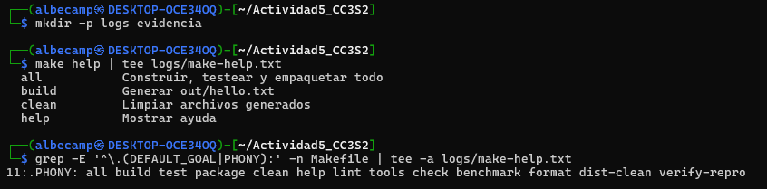

El comando `make help` imprime la lista de opciones disponibles que tenemos en el archivo Makefile, a esta lista se le acompaña una breve descripción de cada una de las opciones, funcionanado así como una guía rápida de cómo usar el `Makefile`. Ahora, cuando se define `.DEFAULT_GOAL := help`, estamos indicando que si se ejecuta `make` sin argumentos, la opción por defecto será la de `help`, mostrando así de manera directa las instrucciones sin necesidad de colocar el comando. Por último, la declaración de `.PHONY` en objetivos nos asegura que siempre se ejecuten aunque haya un archivo con el mismo nombre, evitando así conflictos.

### **2. Comprueba la generación e idempotencia de `build`. Limpia salidas previas, ejecuta `build`, verifica el contenido y repite `build` para constatar que no rehace nada si no cambió la fuente. Comandos:**

```bash
rm -rf out dist
make build | tee logs/build-run1.txt
cat out/hello.txt | tee evidencia/out-hello-run1.txt
make build | tee logs/build-run2.txt
stat -c '%y %n' out/hello.txt | tee -a logs/build-run2.txt
```

> Entrega: explica en 4-6 líneas la diferencia entre la primera y la segunda corrida, relacionándolo con el grafo de dependencias y marcas de tiempo.

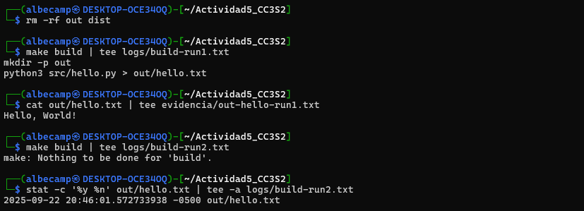

En este caso, en la primera ejecución del `make build`, no existía el archivo `hello.txt` en `out`, así que `make` creó dicho directorio y ejecutó el script `hello.py` para generarlo. Ahora, en la segunda ejecución, `make` detectó que el archivo ya existía, entonces decidió que no había nada para reconstruir. Esto ocurre porque `make` se guía según el grafo de dependencias que usa y también en las fechas de modificación, entonces, si los archivos están actualizados entonces no se vuelve a ejecutar.

### **3. Fuerza un fallo controlado para observar el modo estricto del shell y `.DELETE_ON_ERROR`. Sobrescribe `PYTHON` con un intérprete inexistente y verifica que no quede artefacto corrupto. Comandos:**

```bash
rm -f out/hello.txt
PYTHON=python4 make build ; echo "exit=$?" | tee logs/fallo-python4.txt || echo "falló (esperado)"
ls -l out/hello.txt | tee -a logs/fallo-python4.txt || echo "no existe (correcto)"
```

> Entrega: en 5-7 líneas, comenta cómo `-e -u -o pipefail` y `.DELETE_ON_ERROR` evitan estados inconsistentes.

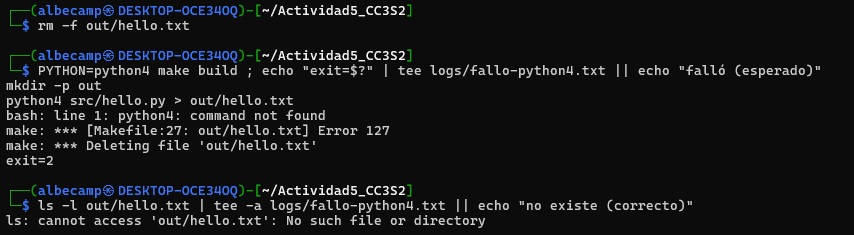

Cuando usamos `-e -u -o pipefail`, activamos un modo estricto del shell, asegurando así que la ejecución falle inmediatamente si es que ocurre un error. Para este caso, sobreescribimos `PYTHON` con uno inexistente (`python4`), enonces la regla falla de inmediato envés de seguir y generar un archivo incompleto. Ahora, el `.DELETE_ON_ERROR` en el `make` elimina automáticamente el archivo que se quizo crear (`out/hello.txt`) con el fin de evitar crear un archivo "corrupto".

### **4. Realiza un "ensayo" (dry-run) y una depuración detallada para observar el razonamiento de Make al decidir si rehacer o no. Comandos:**

```bash
make -n build | tee logs/dry-run-build.txt
make -d build |& tee logs/make-d.txt
grep -n "Considering target file 'out/hello.txt'" logs/make-d.txt
```

> Entrega: resume en 6-8 líneas qué significan fragmentos resultantes.

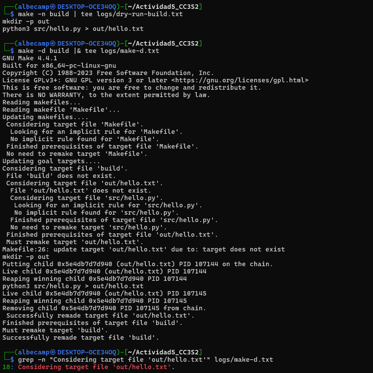

Al ejecutar `make build` con la opción `-n` hacemos que se muestren los pasos que se ejecutarían (sin ejecutarlos de verdad), esto hace que se pueda verificar los pasos antes de ejecutarlo realmente. Ahora, al ejecutar `make build` con la opción `-d`, hacemos que se active el modo de depuración, mostrando cómo `make` analiza el grafo de dependencias y elige que cosas deben reconstruirse. Ahora, en el log generado, notamos como la opción `build` depende de `out/hello.txt`, el cual no existía, por lo que vemos el mensaje `must remake target`. En el log también podemos ver cómo se tiene `src/hello.py` como prerequisito. Por último, el texto "`Considering target file 'out/hello.txt'`" nos indica el momento donde `make` comienza a analizar las dependencias.

### **5. Demuestra la incrementalidad con marcas de tiempo. Primero toca la fuente y luego el target para comparar comportamientos. Comandos:**

```bash
touch src/hello.py
make build | tee logs/rebuild-after-touch-src.txt

touch out/hello.txt
make build | tee logs/no-rebuild-after-touch-out.txt
```

> Entrega: explica en 5-7 líneas por qué cambiar la fuente obliga a rehacer, mientras que tocar el target no forja trabajo extra.

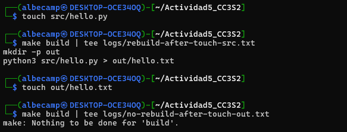

Para este caso, cuando usamos `touch src/hello.py`, la marca de tiempo se actualiza a la del tiempo en el que fue ejecutado (más reciente a la del archivo objetivo, `out/hello.txt`). Entonces, `make` detecta/interpreta que dicho archivo `.txt` está desactualizado respecto a su dependencia (`hello.py`), por lo que al ejecutar `make build` se vuelve a ejecutar la regla que se sigue. En cambio, al ejecutar `touch out/hello.txt`, estamos actualizando la fecha del archivo objetivo, siendo más reciente que la fuente. Entonces, `make` concluye que no hay nada por hacer debido a que el target está más reciente que la fuente.

### **6. Ejecuta verificación de estilo/formato manual (sin objetivos `lint/tools`). Si las herramientas están instaladas, muestra sus diagnósticos; si no, deja evidencia de su ausencia. Comandos:**

```bash
command -v shellcheck >/dev/null && shellcheck scripts/run_tests.sh | tee logs/lint-shellcheck.txt || echo "shellcheck no instalado" | tee logs/lint-shellcheck.txt
command -v shfmt >/dev/null && shfmt -d scripts/run_tests.sh | tee logs/format-shfmt.txt || echo "shfmt no instalado" | tee logs/format-shfmt.txt
```

> Entrega: en 4-6 líneas, interpreta advertencias/sugerencias (o comenta la ausencia de herramientas y cómo instalarlas en tu entorno).

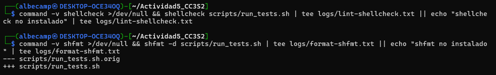

El archivo `logs/lint-shellcheck.txt` quedó vacío debido a que `shellcheck` no encontró algún error ni una advertencia en el script `scripts/run_tests.sh`, lo cual nos indica que el script está bien formateado (según las reglas que aplica `shellcheck`). Ahora, en el caos del `shfmt`, lo que se obtuvo fue un `diff` entre la versión original y la formateada, lo que podría hacer algunos ajustes como identación, espacios o saltos de línea (pero no errores de sintaxis). En este caso ambas herramientas estaban instaladas entonces se pudo seguir con el ejercicio.

### **7. Construye un paquete reproducible de forma manual, fijando metadatos para que el hash no cambie entre corridas idénticas. Repite el empaquetado y compara hashes. Comandos:**

```bash
mkdir -p dist
tar --sort=name --mtime='@0' --owner=0 --group=0 --numeric-owner -cf dist/app.tar src/hello.py
gzip -n -9 -c dist/app.tar > dist/app.tar.gz
sha256sum dist/app.tar.gz | tee logs/sha256-1.txt

rm -f dist/app.tar.gz
tar --sort=name --mtime='@0' --owner=0 --group=0 --numeric-owner -cf dist/app.tar src/hello.py
gzip -n -9 -c dist/app.tar > dist/app.tar.gz
sha256sum dist/app.tar.gz | tee logs/sha256-2.txt

diff -u logs/sha256-1.txt logs/sha256-2.txt | tee logs/sha256-diff.txt || true
```

> Entrega: pega el hash y explica en 5-7 líneas cómo `--sort=name`, `--mtime=@0`, `--numeric-owner` y `gzip -n` eliminan variabilidad.

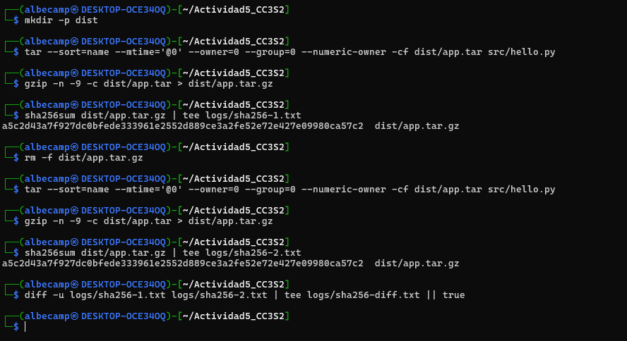

Como hash, en ambos casos, fue: `a5c2d43a7f927dc0bfede333961e2552d889ce3a2fe52e72e427e09980ca57c2`.
Debido a que se tuvo el mismo hash en ambas ejecuciones, entonces queda demostrado que el empaquetado que se realizó es reproducible. Ahora, la opción `--sort=name` hace que los archivos se ordenen alfabéticamente dentro del comprimido. Luego, con `--time=@0`, hacemos que todos los ficheros se registren con una misma marca de tiempo, evitando así diferencias de fechas reales. Por último, con `gzip -n`, desactivamos el guardado de nombre y fecha en la cabecera del comprimido.

### **8. Reproduce el error clásico "missing separator" sin tocar el Makefile original. Crea una copia, cambia el TAB inicial de una receta por espacios, y confirma el error. Comandos:**

```bash
cp Makefile Makefile_bad
# (Edita Makefile_bad: en la línea de la receta de out/hello.txt, reemplaza el TAB inicial por espacios)
make -f Makefile_bad build |& tee evidencia/missing-separator.txt || echo "error reproducido (correcto)"
```

> Entrega: explica en 4-6 líneas por qué Make exige TAB al inicio de líneas de receta y cómo diagnosticarlo rápido.

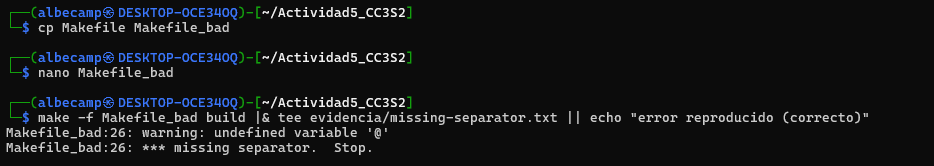

En los archivos `Makefile`, las líneas de receta que indiquen que hay comandos a ejecutar deben iniciar con un `TAB` de manera obligatoria (no con espacios). Entonces, si se usan espacios por error, `make` nos mostrará el mensaje `missing separator`, indicándonos que no es válida la indentación. Ahora, para diagnosticarlo rápidamente es recomendable ver las líneas donde nos muestra el error y corregirlas.

## **Parte 2: Leer - Analizar un repositorio completo**

### **Ejercicios**

**1. Ejecuta `make -n all` para un dry-run que muestre comandos sin ejecutarlos; identifica expansiones `$@` y `$<`, el orden de objetivos y cómo `all` encadena `tools`, `lint`, `build`, `test`, `package`.**

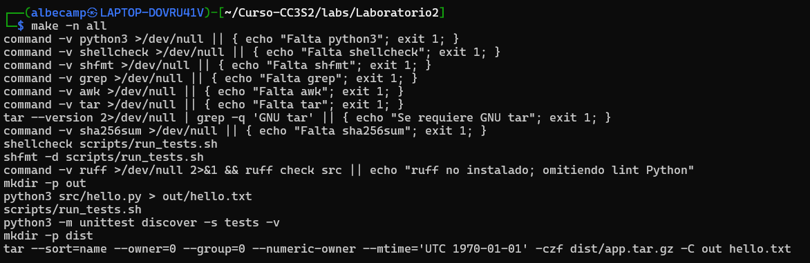

El comando `make -n all` revela que el objetivo `all` ejecuta una cadena en el siguiente orden: `tools, lint, build, test, package`.
Durante el dry-run podemos observar las expansiones de variables automáticas, según en Makefile: `$(@D)` se expande al directorio del target (como el caso de `out` en `mkdir -p out`), `$<` representa el primer prerrequisito (`src/hello.py` en `python3 src/hello.py > out/hello.txt`), y `$@` es el target completo (`out/hello.txt` y `dist/app.tar.gz`). Entonces, el flujo comienza verificando las herramientas disponibles (python3 y shellcheck, por ejemplo), luego ejecuta linters en los scripts bash y python, construye el archivo output usando `src/hello.py`, ejecuta las pruebas unitarias y los scripts de testing y, finalmente, empaqueta todo en un tarball reproducible con timestamps.

**2. Ejecuta `make -d build` y localiza líneas "Considerando el archivo objetivo" y "Debe deshacerse",  explica por qué recompila o no `out/hello.txt` usando marcas de tiempo y cómo `mkdir -p $(@D)` garantiza el directorio.**

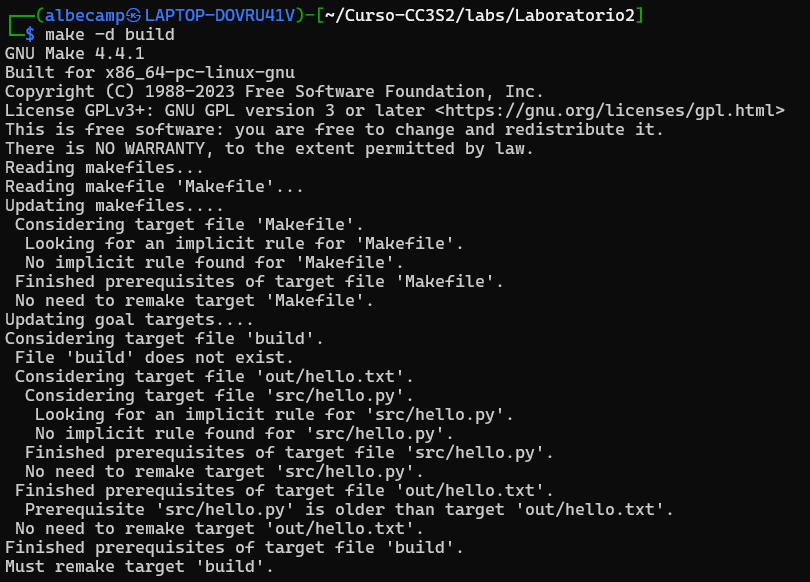

Luego de ejecutar `make -d build`, el output nos  muestra el proceso de decisión que se basan en marcas de tiempo. Primeramente, Make evalúa si `out/hello.txt` necesita recompilarse comparando los timestamps, encuentra que el prerrequisito (`src/hello.py`) es más antiguo que el target `out/hello.txt` (En la parte: "Prerequisite 'src/hello.py' is older than target 'out/hello.txt'"), por lo que Make concluye: "No need to remake target 'out/hello.txt'".
El objetivo de `build` es un target PHONY que no existe como archivo real, por eso vemos la línea: "File 'build' does not exist" y "Must remake target 'build'", pero como no hay comandos propios, simplemente verifica sus dependencias. 
El comando `mkdir -p $(@D)` garantiza que el directorio padre del target exista antes de crear el archivo, se usa la opción `-p` para crear directorios sin fallar si ya existen, así aseguramos que `python3 src/hello.py > out/hello.txt` pueda ejecutarse exitosamente.

**3. Ejecuta `make verify-repro`; observa que genera dos artefactos y compara `SHA256_1` y `SHA256_2`. Si difieren, hipótesis: zona horaria, versión de tar, contenido no determinista o variables de entorno no fijadas.**

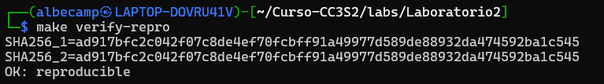

El comando `make verify-repro` genera dos artefactos con SHA256 como hash (`ad917bfc2c042f07c8de4ef70fcbff91a49977d589de88932da474592ba1c545`), confirmando la reproducibilidad. El proceso primeramente limpia directorios, construye el paquete dos veces de manera independiente y compara los hashes resultantes. Ahora, la reproducibilidad se consigue mediante parámetros específicos: `--sort=name` ordena archivos alfabéticamente, `--numeric-owner` y `--owner=0 --group=0` fijan ownership a root, y `--mtime='UTC 1970-01-01'` establece timestamps deterministas en UTC. Entonces, si los hashes son diferentes, las hipótesis podrían ser: zona horaria inconsistente afectando timestamps, contenido no determinista como números random en el código fuente o variables de entorno no controladas que afectan la generación.

## **Parte 3: Extender**

### **3.1. `lint` mejorado**

Rompe a propósito un quoting en `scripts/run_tests.sh` (por ejemplo, quita comillas a una variable que pueda contener espacios) y ejecuta `make lint`. `shellcheck` debe reportar el problema; corrígelo y vuelve a correr. Luego ejecuta `make format` para aplicar `shfmt` y estandarizar estilo. Si tienes `ruff`, inspecciona Python y corrige advertencias. *(Nota: si `ruff` no está instalado, el Makefile ya lo trata como opcional y no debe romper la build.)*

```bash
make lint
make format
ruff check src || true
```

Se le quitó la comilla doble final para la variaable `tmp`, quedando así: `tmp="$(mktemp)`.

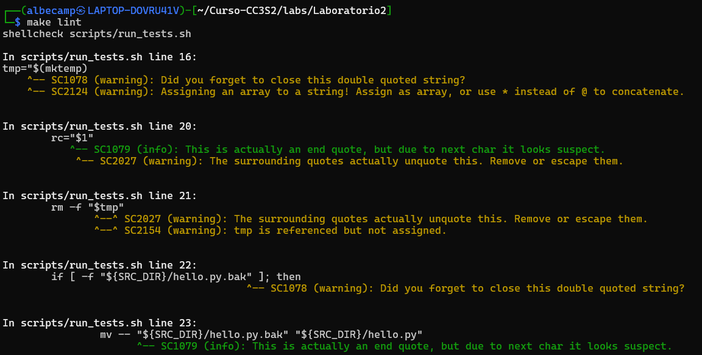

Luego de la corrección, se ejecuta nuevamente `make lint` y `make format`.

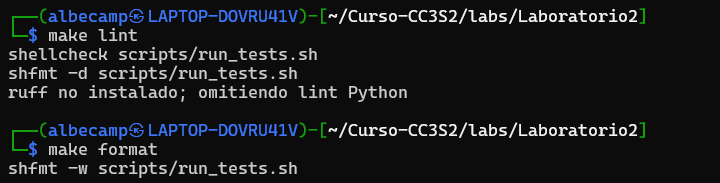